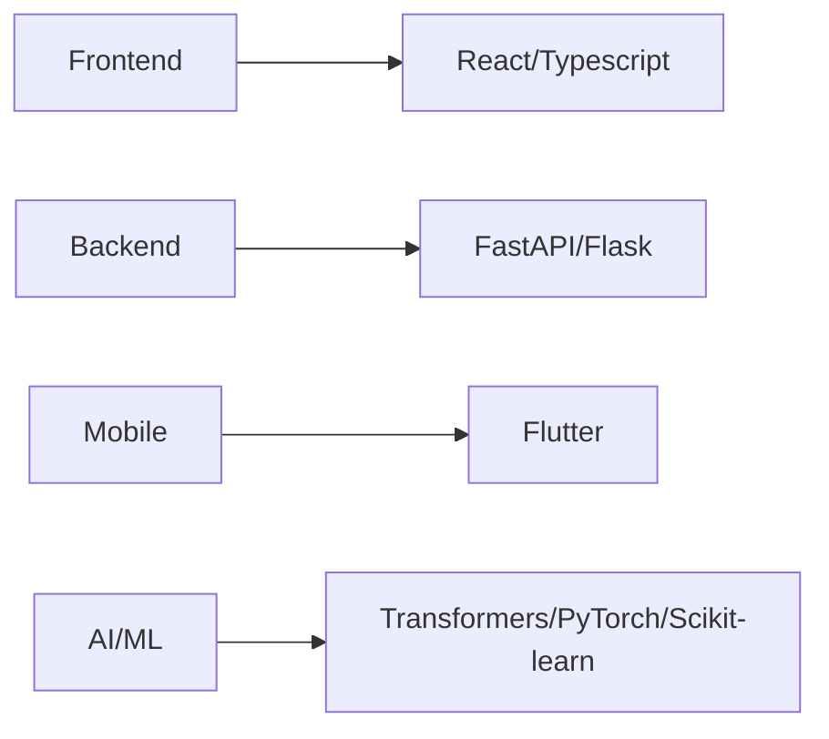

# 👋 Hey there! I'm Adilzhan Baidalin

<div align="center">
  


</div>

---

## 🚀 About Me

I'm a passionate **AI Engineer** and **Researcher** focused on pushing the boundaries of artificial intelligence. Currently diving deep into **Computer Vision**, **Natural Language Processing**, **Large Language Models**, and **AI Agents** while building innovative startups and research projects.

```python
class AdilzhanBaidalin:
    def __init__(self):
        self.username = "AdilzhanB"
        self.current_focus = [
            "Computer Vision (CV)",
            "Natural Language Processing (NLP)", 
            "Large Language Models (LLMs)",
            "AI Agents Development",
            "Reinforcement Learning (RL)",
            "Deep Learning Research",
            "Startup Building"
        ]
        self.currently_working_on = "Revolutionary AI solutions"
        self.fun_fact = "I turn coffee into AI models ☕ → 🤖"
    
    def say_hi(self):
        print("Thanks for dropping by! Let's build something amazing together!")
```
---

## 🎨 **Tech Arsenal**

<div align="center">

### 🔧 **Languages & Frameworks**


### 📈 **GitHub Statistics**


### 🔥 **Contribution Flame**

[](https://git.io/streak-stats)


</div>

---

## 🌌 **Activity Constellation**

<div align="center">


</div>

---

## 🎭 **Profile Highlights**

<div align="center">

<table>
<tr>
<td align="center" width="33%">

### 🎯 **Focus Areas**


</td>
<td align="center" width="33%">

### 🚀 **Current Mission**
- 🔬 Exploring AI/ML
- 🌐 Building Full-Stack Apps
- 📱 Mobile Development
- 🎨 UI/UX Design

</td>
<td align="center" width="33%">

### 💡 **Fun Facts**
- ☕ Coffee-driven developer
- 🌙 Night owl coder
- 🎮 Gaming enthusiast
- 📚 Continuous learner

</td>
</tr>
</table>

</div>

---

## 🛠️ Tech Stack & Tools

<div align="center">

### **Programming Languages**
<p>


</p>

### **AI/ML Frameworks**
<p>


</p>

### **Web Development**
<p>


</p>

### **Tools & Platforms**
<p>


</p>

</div>

---

## 🤝 Let's Connect & Collaborate!

<div align="center">

[](https://github.com/AdilzhanB)
[](https://www.linkedin.com/in/baidalin-adilzhan-55b810338/)
[](https://www.instagram.com/baidalin_adilzhan/#)
[](mailto:adekabai2012@gmail.com)
[](https://leetcode.com/u/adilbai)
[](https://codeforces.com/profile/AdilzhanB)
</div>

---

<div align="center">

### 💭 *"The future belongs to those who believe in the beauty of their dreams."*

**Let's build the future of AI together! 🚀**


</div>

---

⭐️ **From [AdilzhanB](https://github.com/AdilzhanB)** - *Always learning, always building!*
